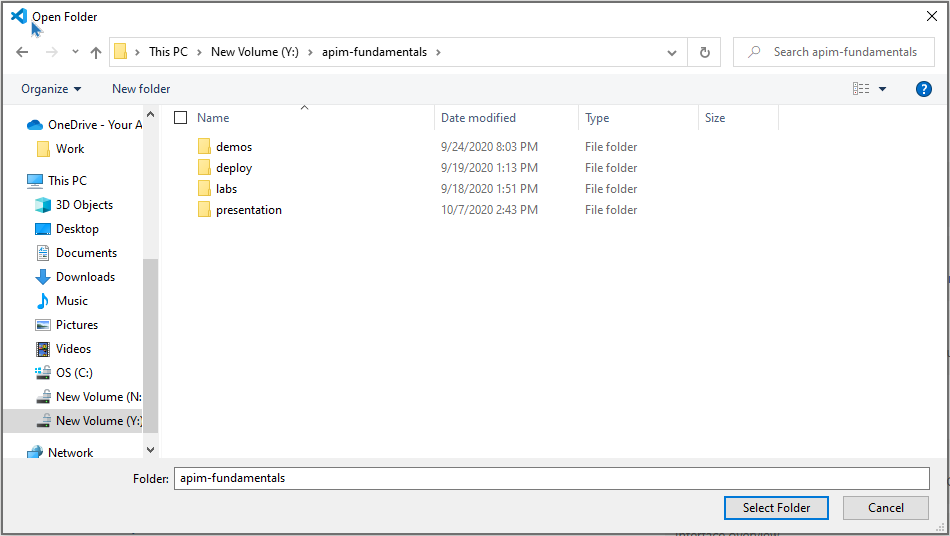
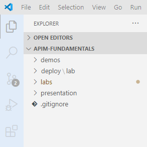
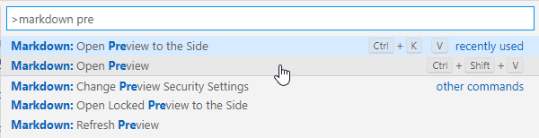

# How to view the lab instructions?

> The trainer will provide you the download link for the training package

* Download and unzip the training package

* The lab instructions are written in *Markdown*

* Open **Visual Studio Code**

* Click on *File > Open Folder* 

* Select the root folder of the training package and click **Select Folder**

* On the left-hand side, you can navigate through the demos, labs and presentation

* Open one of the *lab-instructions.md* files

* Press `F1` and type "markdown preview".  Choose `Markdown: Open Preview` 

* The lab instructions are now nicely rendered in Visual Studio Code

> Happy learning!!!
